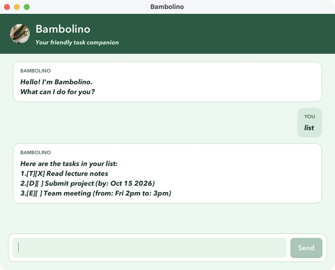

# Bambolino User Guide

Bambolino helps you keep track of to-dos, deadlines, and events. Type a command in the input
field and press Enter or click Send. Task numbers refer to the current `list` output.

## Getting started

1. Install Java 25 with JavaFX (Zulu `25.0.3.fx-zulu` is the version used by this project).
2. Download `bambolino.jar` from the [releases page](https://github.com/antaradaw/ip/releases)
   when a release is available, or build it with `./gradlew shadowJar` from the repository.
3. Put the JAR in a folder where you want to keep your tasks. Open a terminal in that folder
   and run `java -jar bambolino.jar`.
4. Try `todo borrow book`, then `list`. Bambolino saves task changes automatically.

## Commands

| Action | Example |
| --- | --- |
| Add a to-do | `todo borrow book` |
| Add a deadline | `deadline return book /by 2026-10-15` |
| Add an event | `event meeting /from Mon 2pm /to 4pm` |
| View all tasks | `list` |
| Search descriptions | `find book` |
| Mark complete | `mark 1` |
| Mark incomplete | `unmark 1` |
| Delete a task | `delete 1` |
| Say goodbye | `bye` |

Deadline dates must be real dates in `yyyy-mm-dd` format. Event start and end values are
free-form text. Use each required parameter (`/by`, `/from`, `/to`) once, separated by spaces.
Descriptions cannot be empty. Commands and aliases ignore letter case.
Search matches part of a description and ignores letter case. In the console, `bye` exits; in the GUI it displays a farewell.
Close the window to exit the GUI.

For example, after `todo borrow book`, `list` shows `1.[T][ ] borrow book`.
Run `mark 1` to change it to `1.[T][X] borrow book`; `unmark 1` reverses this.
`delete 1` permanently removes the task, so check its number first. Later tasks are renumbered.
Search results keep the numbers from the full list: use those numbers to mark or delete a match.
`find` requires a keyword; `list` and `bye` take no arguments.

## Friendlier command syntax

Bambolino accepts these case-insensitive command aliases:

| Full command | Alias |
| --- | --- |
| `todo` | `t` |
| `deadline` | `d` |
| `event` | `e` |
| `list` | `l` |
| `find` | `f` |
| `delete` | `del` |
| `mark` | `m` |
| `unmark` | `um` |
| `bye` | `q` |

Aliases accept the same arguments and produce the same output as their full commands.

## Errors and saved tasks

Invalid commands display an explanation so you can correct them. In the GUI, failed commands
remain selected in the input field for editing.

Tasks are saved to `data/bambolino.txt` relative to the launch directory. If it is missing,
Bambolino starts with an empty list and creates the file when saving a task. To restore existing
tasks, close the app and place your backed-up file at that location.

Corrupt task records are skipped with a warning; valid records are still loaded. If the file
cannot be read, a warning appears and the app starts empty. Back up and repair the original
file before changing tasks, because later saves write the current list.

If saving fails, check that the data folder is writable and that the file path is not a directory.
The change remains in memory but may be lost when you close the app; a later successful change
saves the current list.
